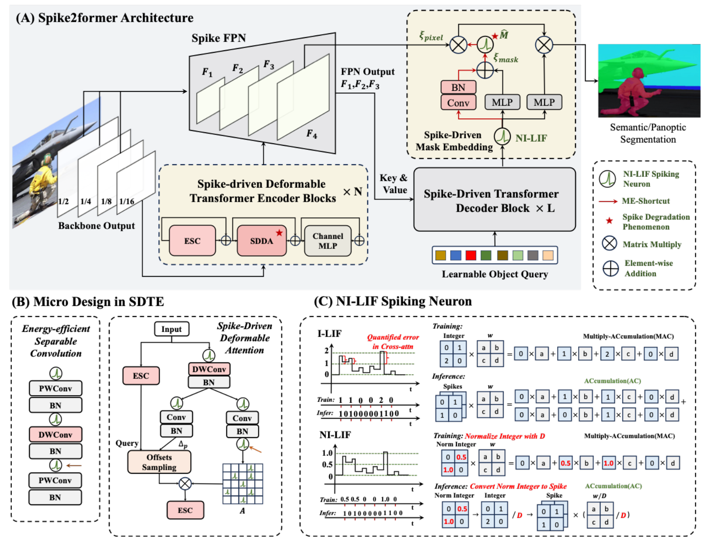

## **Spike2Former: Efficient Spiking Transformer for High-performance Image Segmentation (AAAI 2025 Oral)**

Zhenxin Lei∗ , Man Yao , Jiakui Hu∗ , Xinhao Luo, Yanye Lu, Bo Xu , Guoqi Li

BICLab, Institute of Automation, Chinese Academy of Sciences

### About Spike2Former

Spiking Neural Networks (SNNs) have a low-power advantage but perform poorly in image segmentation tasks. The reason is that directly converting neural networks with complex architectural designs for segmentation tasks into spiking versions leads to performance degradation and non-convergence. To address this challenge, we first identify the modules in the architecture design that lead to the severe reduction in spike firing, make targeted improvements, and propose Spike2Former architecture. Second, we propose normalized integer spiking neurons to solve the training stability problem of SNNs with complex architectures. We set a new state-of-the-art for SNNs in various semantic segmentation dataset. 


### 🎉 News 🎉

 2024.12.9: Our Spike2Former has been accepted by AAAI 2025 (Oral).

2025.1.20: Upload code.

### Train and Test Spike2Former

- Get Start.

  Before training and testing, please build the mmsegmentation (v1.1.1) and mmdetection (v3.1.0) environment with the following command, you should also refer to the official get_start guidline of mmsegmentation to build Openmim, mmcv, and mmengine according to you CUDA version, and form the dataset:

  ```
  # Before install Spike2Former, please ensure you have installed openmim, mmcv=2.0.1(Suggest), mmengine=0.8.4(Suggest)
  
  cd Spike2Former
  
  # For semantic segmentation
  cd segmentation
  pip install -v -e .
  
  # For panoptic segmentation
  cd detection
  pip install -v -e .
  # '-v' means verbose, or more output
  # '-e' means installing a project in editable mode,
  ```

  

- Run the following command to train Spike2Former, the pretrained weight in Spike2Former can be download from [Meta-Spikeformer](https://github.com/BICLab/Spike-Driven-Transformer-V2). For more training settings, please refer to ./config/Spike2Former for more details.

  ```
  cd Spike2Former
  cd tools
  CUDA_VISIBLE_DEVICES=0,1,2,3,4,5,6,7 ./dist_train.sh ../configs/Spikeformer/SDTv2_maskformer_DCNpixelDecoder_ade20k.py 8
  ```

- Run the following command to test Spike2Former：

  ```
  cd Spike2Former
  cd tools
  ./test.sh 
  ```

- Some useful tools:

  You can use `cal_firing_num.py` to anlysis the firing rate of spike neurons, run the `./dist_test.sh` for evaluation.

## Benchmark and model zoo

Results and models will be available in the [model zoo](docs/en/model_zoo.md).

<details open>
<summary>Supported backbones:</summary>

- [ ] [Meta-SpikeFormer(ICLR'2024)](https://github.com/BICLab/Spike-Driven-Transformer-V2)
- [ ] [E-SpikeFormer(T-PAMI 2025)](https://github.com/BICLab/Spike-Driven-Transformer-V3)

</details>

<details open>
<summary>Supported datasets:</summary>

- [x] [Cityscapes](https://github.com/open-mmlab/mmsegmentation/blob/main/docs/en/user_guides/2_dataset_prepare.md#cityscapes)
- [x] [PASCAL VOC](https://github.com/open-mmlab/mmsegmentation/blob/main/docs/en/user_guides/2_dataset_prepare.md#pascal-voc)
- [x] [ADE20K](https://github.com/open-mmlab/mmsegmentation/blob/main/docs/en/user_guides/2_dataset_prepare.md#ade20k)
- [x] [Pascal Context](https://github.com/open-mmlab/mmsegmentation/blob/main/docs/en/user_guides/2_dataset_prepare.md#pascal-context)
- [x] [COCO-Stuff 10k](https://github.com/open-mmlab/mmsegmentation/blob/main/docs/en/user_guides/2_dataset_prepare.md#coco-stuff-10k)
- [x] [COCO-Stuff 164k](https://github.com/open-mmlab/mmsegmentation/blob/main/docs/en/user_guides/2_dataset_prepare.md#coco-stuff-164k)

</details>

## Citation

If you find this project useful in your research, please consider cite:

```bibtex
@article{lei2024spike2former,
  title={Spike2Former: Efficient Spiking Transformer for High-performance Image Segmentation},
  author={Lei, Zhenxin and Yao, Man and Hu, Jiakui and Luo, Xinhao and Lu, Yanye and Xu, Bo and Li, Guoqi},
  journal={arXiv preprint arXiv:2412.14587},
  year={2024}
}
```

