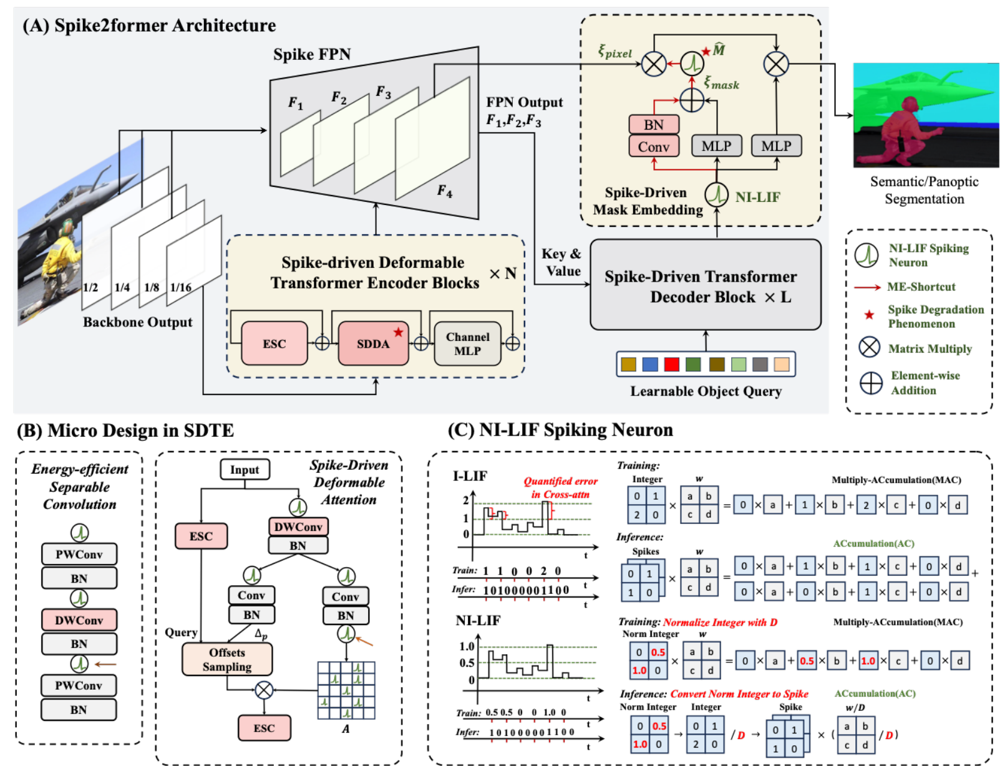

## **Spike2Former: Efficient Spiking Transformer for High-performance Image Segmentation (AAAI 2025 Oral)**

Zhenxin Lei∗ , Man Yao , Jiakui Hu∗ , Xinhao Luo, Yanye Lu, Bo Xu , Guoqi Li

BICLab, Institute of Automation, Chinese Academy of Sciences

### About Spike2Former

Spiking Neural Networks (SNNs) have a low-power advantage but perform poorly in image segmentation tasks. The reason is that directly converting neural networks with complex architectural designs for segmentation tasks into spiking versions leads to performance degradation and non-convergence. To address this challenge, we first identify the modules in the architecture design that lead to the severe reduction in spike firing, make targeted improvements, and propose Spike2Former architecture. Second, we propose normalized integer spiking neurons to solve the training stability problem of SNNs with complex architectures. We set a new state-of-the-art for SNNs in various semantic segmentation dataset. 


### 🎉 News 🎉

 2024.12.9: Our Spike2Former has been accepted by AAAI 2025 (Oral).

2025.1.20: Upload code.

### Installation and usage

The semantic segmentation code is in [`Segmentation/`](Segmentation/) (MMSegmentation 1.1.1). The panoptic segmentation code is in [`detection/`](detection/) (MMDetection 3.1.0). Each directory contains its own `mmdet` package, so use separate Python environments for the two tasks. Install PyTorch, MMCV 2.0.1, MMEngine 0.8.4, and the matching CUDA build before installing the project. Run each example from the repository root in its own environment.

```bash
# Semantic segmentation environment
cd Segmentation
pip install -v -e .
export ADE20K_ROOT=/path/to/ADEChallengeData2016
export SPIKE2FORMER_BACKBONE_CKPT=/path/to/pretrained_backbone.pth
CUDA_VISIBLE_DEVICES=0 ./tools/test.sh \
  configs/Spike2Former/released/ADE20K_V2_L_iter155000.py \
  /path/to/ADE20K-V2-L-ckpt-best.pth
```

```bash
# Panoptic segmentation environment
cd detection
pip install -v -e .
export COCO_ROOT=/path/to/coco/
export SPIKE2FORMER_BACKBONE_CKPT=/path/to/pretrained_backbone.pth
CUDA_VISIBLE_DEVICES=0,1,2,3,4,5,6,7 ./tools/dist_train.sh \
  configs/spike2former/spike2former_sdtv2_ms-8xb2-50e_coco.py 8
```

The released segmentation configs use `ADE20K_ROOT`, `CITYSCAPES_ROOT`, and `VOC2012_ROOT` for dataset locations. Detection configs use `COCO_ROOT` or `ADE20K_ROOT`. `SPIKE2FORMER_BACKBONE_CKPT` is optional for loading a pretrained backbone; without it, the model initializes from scratch. The original backbone weights are linked at [Spike2Former Backbone](https://pan.baidu.com/s/1utTHItl5PdcCaKfyZY_XLA?pwd=gtqy). Adjust batch size and workers for your hardware.

### Released semantic segmentation checkpoints

These configs preserve the corresponding run's model and evaluation settings. Local dataset paths and automatic resume settings have been adapted for release. The checkpoints are hosted separately and are not stored in Git.
SHA-256 hashes for the five files are recorded in [`checkpoint_checksums.sha256`](checkpoint_checksums.sha256).

| Dataset | Run | Config | Checkpoint |
| --- | --- | --- | --- |
| ADE20K | Spike2Former-L, V2 | [`ADE20K_V2_L_iter155000.py`](Segmentation/configs/Spike2Former/released/ADE20K_V2_L_iter155000.py) | [ADE20K-V2-L-ckpt-best.pth](https://huggingface.co/ZhenXXXXXin/Spike2Former/resolve/main/ADE20K-V2-L-ckpt-best.pth?download=true) |
| ADE20K | SDTv2 | [`ADE20K_SDTv2_iter102500.py`](Segmentation/configs/Spike2Former/released/ADE20K_SDTv2_iter102500.py) | [ADE20K-SDTv2-ckpt-best.pth](https://huggingface.co/ZhenXXXXXin/Spike2Former/resolve/main/ADE20K-SDTv2-ckpt-best.pth?download=true) |
| Cityscapes | SDTv2 | [`Cityscapes_SDTv2_iter75000.py`](Segmentation/configs/Spike2Former/released/Cityscapes_SDTv2_iter75000.py) | [Cityscapes-SDTv2-ckpt-best.pth](https://huggingface.co/ZhenXXXXXin/Spike2Former/resolve/main/Cityscapes-SDTv2-ckpt-best.pth?download=true) |
| PASCAL VOC 2012 | 1×4 | [`VOC2012_1x4_iter97500.py`](Segmentation/configs/Spike2Former/released/VOC2012_1x4_iter97500.py) | [VOC2012-1x4-ckpt-best.pth](https://huggingface.co/ZhenXXXXXin/Spike2Former/resolve/main/VOC2012-1x4-ckpt-best.pth?download=true) |
| PASCAL VOC 2012 | 4×4 | [`VOC2012_4x4_iter72500.py`](Segmentation/configs/Spike2Former/released/VOC2012_4x4_iter72500.py) | [VOC2012-4x4-ckpt-best.pth](https://huggingface.co/ZhenXXXXXin/Spike2Former/resolve/main/VOC2012-4x4-ckpt-best.pth?download=true) |

The implementation also supports [Meta-SpikeFormer](https://github.com/BICLab/Spike-Driven-Transformer-V2) and [E-SpikeFormer](https://github.com/BICLab/Spike-Driven-Transformer-V3) backbones. Other segmentation dataset configurations include [Pascal Context](https://github.com/open-mmlab/mmsegmentation/blob/main/docs/en/user_guides/2_dataset_prepare.md#pascal-context), [COCO-Stuff 10k](https://github.com/open-mmlab/mmsegmentation/blob/main/docs/en/user_guides/2_dataset_prepare.md#coco-stuff-10k), and [COCO-Stuff 164k](https://github.com/open-mmlab/mmsegmentation/blob/main/docs/en/user_guides/2_dataset_prepare.md#coco-stuff-164k).

### Notes

- Training and test entry points accept the config and checkpoint as arguments: `Segmentation/tools/dist_train.sh`, `Segmentation/tools/test.sh`, `detection/tools/dist_train.sh`, and `detection/tools/dist_test.sh`.
- The panoptic code and the missing pixel decoder module address [Issue #5](https://github.com/BICLab/Spike2Former/issues/5) and [Issue #6](https://github.com/BICLab/Spike2Former/issues/6).

## Citation

If you find this project useful in your research, please consider cite:

```bibtex
@article{lei2024spike2former,
  title={Spike2Former: Efficient Spiking Transformer for High-performance Image Segmentation},
  author={Lei, Zhenxin and Yao, Man and Hu, Jiakui and Luo, Xinhao and Lu, Yanye and Xu, Bo and Li, Guoqi},
  journal={arXiv preprint arXiv:2412.14587},
  year={2024}
}
```
